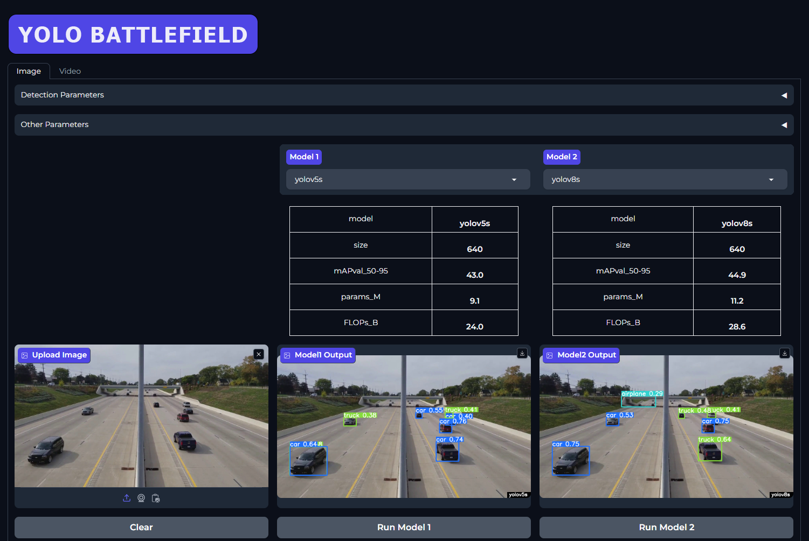

# 𝐘𝐎𝐋𝐎-𝐁𝐚𝐭𝐭𝐥𝐞𝐟𝐢𝐞𝐥𝐝 ⚠️🔥

[**Try this on Huggingface Spaces**](https://huggingface.co/spaces/Pamudu/YOLO-Battlefield)

Users can try out the provided examples, upload images and videos, and compare the results.

---

This Hugging Face space is currently running on a CPU instance, resulting in higher processing times and lower FPS values compared to using a GPU. However, this does not affect the relative comparison between the models.

If you run this application locally on a GPU machine, you can use your machine's hardware to run the models on either the GPU or CPU.

Sometimes, when you run a model for the first time, the processing time might be inaccurate. If this happens, rerun with the same configurations to obtain more accurate processing times.

**Upcoming Features**
Integration of more YOLO models